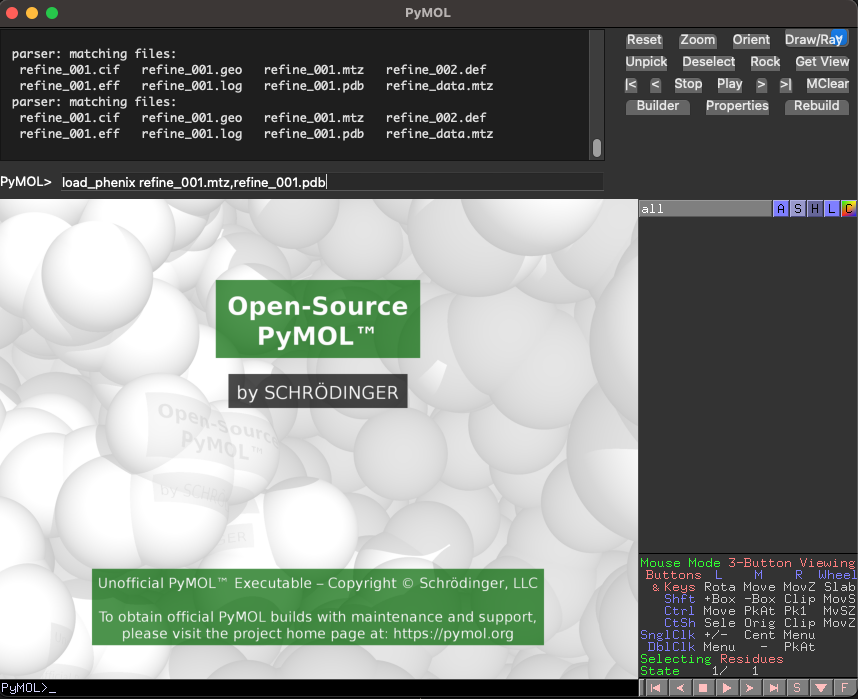
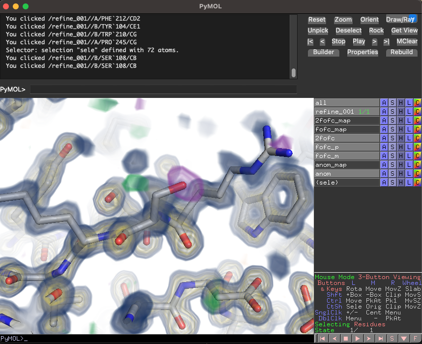
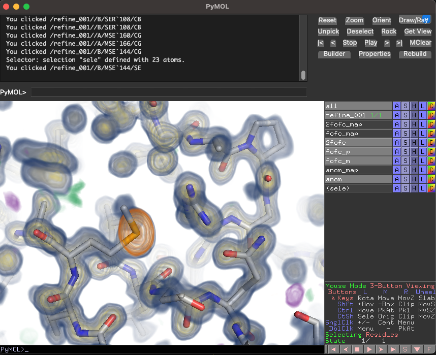

# pymolrc
PyMOL Configuration File Maintained by the RS Community

# Installation
Install by appending this contents of `pymolrc` to your `.pymolrc` file using the following command on mac or linux:
```
curl -L https://github.com/rs-station/pymolrc/raw/refs/heads/main/pymolrc >> $HOME/.pymolrc
```
On windows, please manually [copy](https://github.com/rs-station/pymolrc/raw/refs/heads/main/pymolrc) the contents to your `pymolrc.pml` file.

# Features
### `load_phenix` Function
Mtz support is one of the pain points with the open source version of PyMOL. To address this shortcoming, we provide a `load_phenix` method defined in this rc file which will load 2Fo-Fc, Fo-Fc, and Anomalous difference maps from PHENIX refinement output into a pymol session. 



The function will automatically load the 2Fo-Fc and Fo-Fc maps,


As well as the anomalous difference map if present,

